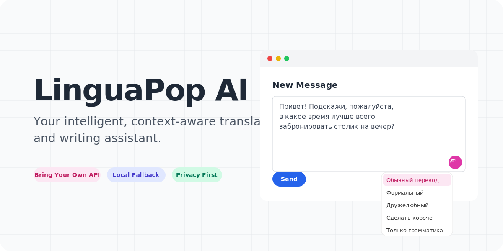

<div align="center">
  <picture>
    <source media="(prefers-color-scheme: dark)" srcset="assets/readme/hero.gif">
    <source media="(prefers-color-scheme: light)" srcset="assets/readme/hero.gif">
    
  </picture>
</div>

<p align="center">
  <strong>ИИ-расширение для Chromium: бесшовный контекстный перевод, переписывание текста и локализация PDF-документов с использованием ваших собственных API-ключей.</strong>
</p>

<p align="center">
  <a href="README.md">🇺🇸 Read in English</a>
</p>

---

**LinguaPop AI** интегрирует мощь современных языковых моделей прямо в ваш браузер. Вместо того чтобы переключаться между вкладками для перевода фразы или переписывания письма, используйте LinguaPop — он работает прямо в полях ввода и на страницах, предлагая контекстный перевод и адаптацию текста.

## ✨ Почему LinguaPop?

Большинство расширений используют стандартный машинный перевод (например, Google Translate). LinguaPop напрямую подключается к лучшим LLM (OpenAI, Anthropic, Gemini, Mistral) через ваши собственные API-ключи. Это означает, что переводы получаются не просто точными, но и учитывают контекст, звучат естественно и сохраняют исходный тон.

### Главные функции

* **🤖 Поддержка ваших ключей (BYOK):** Нативная поддержка OpenAI (ChatGPT), Anthropic (Claude), Google (Gemini) и Mistral. Вы полностью контролируете свои расходы и приватность.
* **⚡ Умный локальный запасной вариант (Fallback):** Если ваш ключ API исчерпал лимит или пропал интернет, LinguaPop автоматически переключается на встроенную локальную нейросеть Chrome (модель Nano), чтобы вы никогда не оставались без перевода.
* **✍️ Встроенный помощник для письма:** Сфокусируйтесь на любом текстовом поле ввода в вебе (письмо, чат, комментарий). Нажмите плавающую розовую кнопку LinguaPop, чтобы мгновенно переписать черновик на естественный английский. Выбирайте нужный тон: *Обычный перевод, Формальный, Дружелюбный, Сделать короче* или *Только грамматика*.
* **📄 Локализация PDF-документов:** Нажмите правой кнопкой мыши на любую локальную или удаленную ссылку на PDF и выберите "Открыть в LinguaPop PDF" для просмотра и перевода документов прямо в браузере.
* **🌊 "Водопадный" перевод страниц:** Переводите веб-страницы целиком с красивым эффектом потоковой подгрузки сверху вниз. Расширение разбивает текст на абзацы и заменяет их в реальном времени.
* **🗄️ Молниеносный кэш (LRU):** 100% локальное кэширование в `chrome.storage` обеспечивает моментальную загрузку повторяющихся фраз (0мс) и экономит ваши токены API.

## 🚀 Установка

Вы можете установить LinguaPop загрузив уже собранную версию (релиз) или собрав расширение из исходного кода.

### Самый простой способ (готовый релиз)

1. Перейдите на страницу [Releases](../../releases) в этом репозитории.
2. Скачайте последний архив `dist.zip`.
3. Распакуйте ZIP-архив в удобную папку на компьютере.
4. Откройте любой Chromium-браузер (Chrome, Edge, Brave) и перейдите по адресу `chrome://extensions`.
5. Включите **Режим разработчика (Developer mode)** в правом верхнем углу.
6. Нажмите **Загрузить распакованное расширение (Load unpacked)** и выберите папку, в которую вы распаковали `dist.zip`.

### Сборка из исходников (для разработчиков)

Требуется [Node.js](https://nodejs.org/) v18+.

```bash
git clone https://github.com/kkonstantin08/translator.git
cd translator
npm install
npm run build
```
Загрузите созданную папку `dist` в `chrome://extensions` через кнопку **Load unpacked**.

## ⚙️ Настройка провайдера ИИ

Для работы LinguaPop вам необходимо настроить выбранного ИИ-провайдера.

1. Кликните по иконке LinguaPop на панели браузера, чтобы открыть **Настройки (Options Page)**.
2. Перейдите на вкладку **"Провайдеры ИИ"**.
3. Выберите провайдера (OpenAI, Anthropic, Gemini или Mistral) и вставьте ваш API-ключ. Ключи безопасно хранятся в вашем браузере.
4. **Рекомендуется:** Включите "Chrome Built-in AI" в разделе Fallback-переводчика, чтобы обеспечить возможность перевода оффлайн или без квот API.

## 🔒 Приватность и Безопасность

**Ваши данные принадлежат только вам.** 
LinguaPop отправляет текст, который вы переводите, только напрямую тому ИИ-провайдеру, которого вы выбрали и настроили.

* **Локальные ключи:** API-ключи хранятся локально и безопасно в `chrome.storage`.
* **Никакой телеметрии:** Расширение не собирает аналитику, метрики и не следит за пользователями в фоне.
* **Локальный кэш:** История переводов и кэш хранятся только на вашем устройстве.

---

<div align="center">
  <em>Создано для комфортного многоязычного интернета.</em>
</div>
